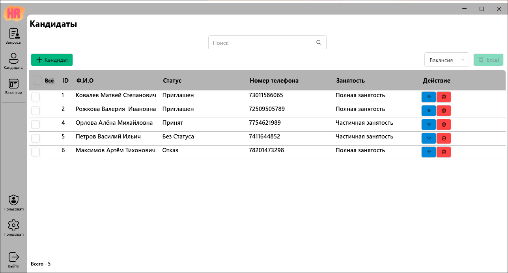
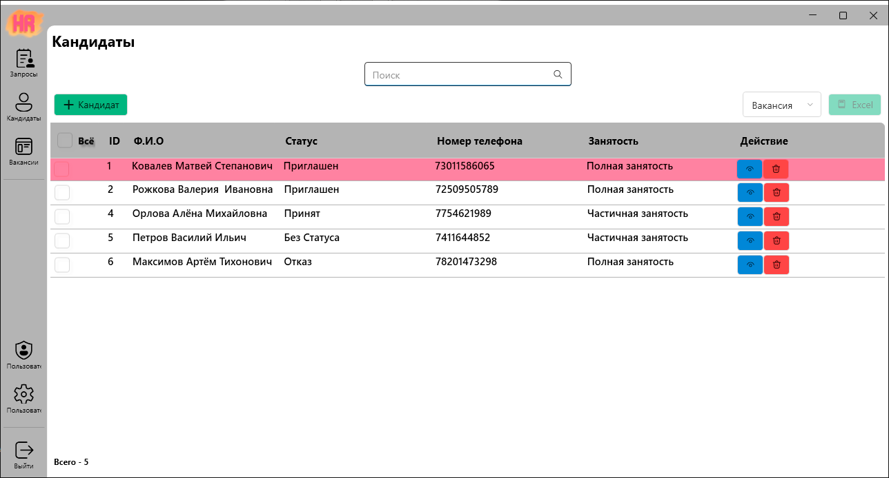
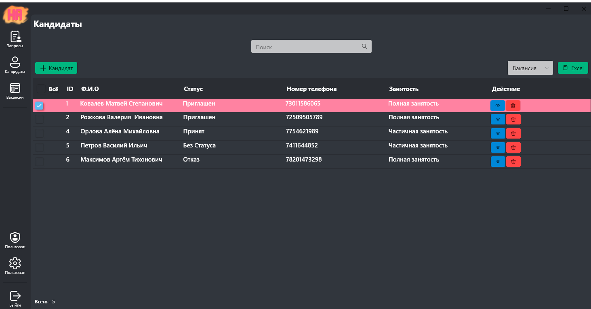
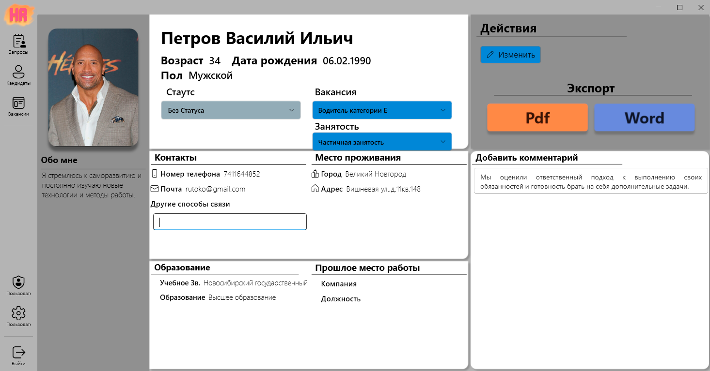
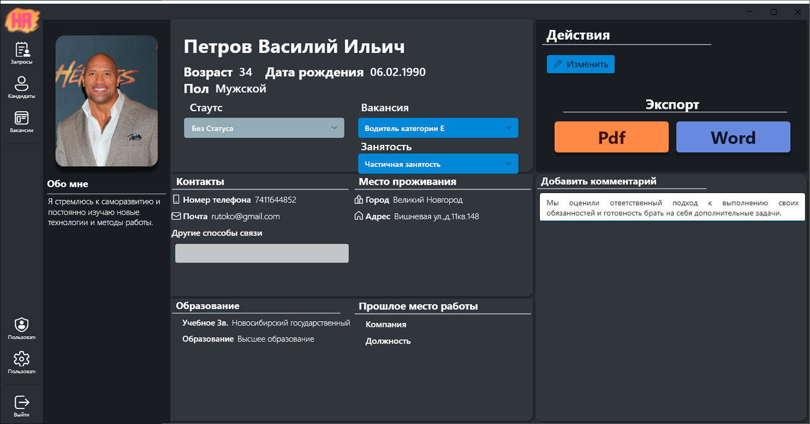
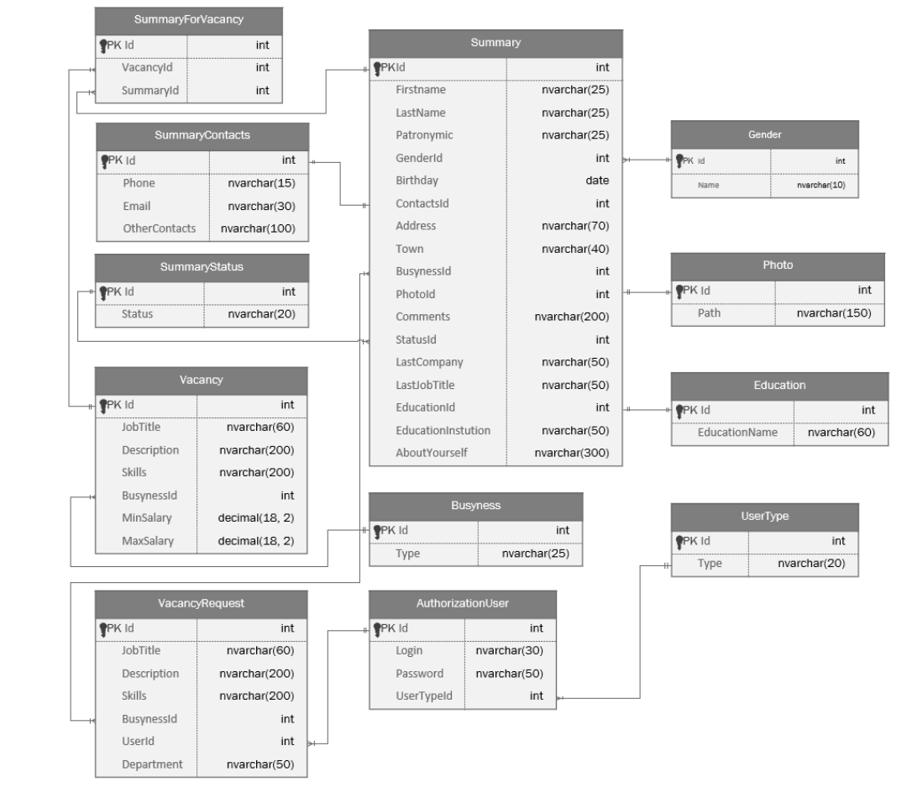

# HrHelper 💼
## О программе
**HR Helper** — программное обеспечение для автоматизации рекрутинговых процессов. Решение помогает HR-менеджерам управлять кандидатами: от первичного внесения резюме до аналитики и экспорта данных.

    

## 📥 Установка
1. Скачайте последний релиз из [раздела Releases]()
2. Установите .NET 6 Runtime (если не установлен)
3. Запустите `HrHelper.Setup.exe` и следуйте инструкциям

## 🛠️ Требования к системе
| Компонент           | Минимальные требования          |
|---------------------|----------------------------------|
| **ОС**              | Windows 10/11 (64-bit)          |
| **Процессор**       | x64-совместимый, 1.2 GHz        |
| **ОЗУ**             | 2 GB (рекомендуется 4 GB)       |
| **Место на диске**  | 200 MB                          |
| **Дополнительно**   | .NET 6 Desktop Runtime          |

## 📖 Функционал 
### 👤 Роли и возможности 
#### 1. HR-менеджер
- **Управление кандидатами**:
  - Добавление/редактирование резюме в базе данных
  - Контроль статусов (Приглашен, Отказ, Принят, Без статуса)
  - Привязка к вакансиям
- **Экспорт данных**:
  - Резюме в Word/PDF
  - Таблицы кандидатов в Excel
- **Работа с вакансиями**:
  - Создание на основе клиентских запросов
  - Просмотр статистики

#### 2. Администратор
- **Управление пользователями**:
  - Создание/удаление аккаунтов
  - Назначение ролей и прав доступа
- **Полный доступ** ко всем функциям HR-менеджера

#### 3. Клиент
- Отправка запросов на новые вакансии
- Просмотр статуса по текущим заявкам

### 🔄 Входные/выходные данные
| Тип данных         | Примеры                          |
|---------------------|----------------------------------|
| **Входные**         | Резюме (PDF/DOC), вакансии (текст), учетные данные (логин/пароль) |
| **Выходные**        | Отчеты (PDF/Word), таблицы (Excel), системная аналитика |

  
  
  
  
  
  

## Техническая реализация ⚙️
## Требования к системе
### Стек технологий
- **Backend**: 
  - .NET 6 (WPF)
  - Entity Framework (ORM)
  - MS SQL Server (хранение данных)
- **Frontend**:
  - WPF-UI (современный UI-фреймворк)
- **Дополнительно**:
  - Newtonsoft.Json (работа с JSON)
  - DocX (генерация Word-документов)
  - Dr.Explain (документация)

### Архитектура БД

  
   
  <em>ER-диаграмма структуры базы данных</em>

